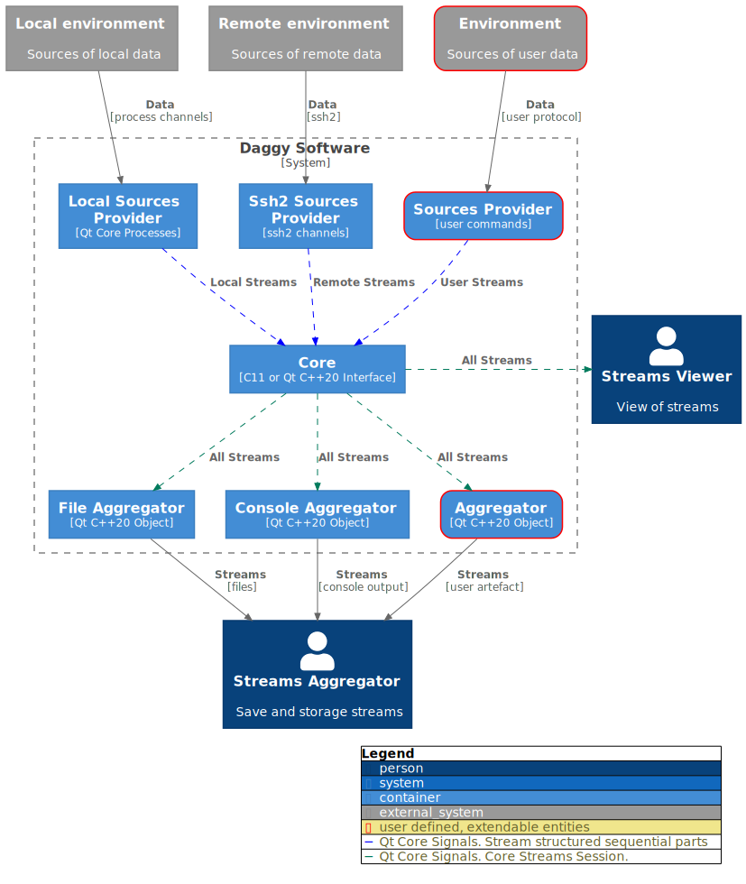

# About Daggy


**Daggy - Data Aggregation Utility and C/C++ developer library for data streams catching**

**Daggy** main goals are server-less, cross-platform, simplicity and ease-of-use.

**Daggy** can be helpful for developers, QA, DevOps and engineers for debug, analyze and control any data streams, including requests and responses, in distributed network systems, for example, based on micro-service architecture.


In short terms, daggy run local or remote processes at the same time, simultaneously read output from processes, stream and aggregate them under once session



Daggy Screencast


* [Introduction and goal concepts](./#introduction-and-goal-concepts)
  * [Daggy High Level Design](./#daggy-high-level-design)
  * [Basic terms](./#basic-terms)
* [Getting Started](./#getting-started)
  * [Getting Daggy](./#getting-daggy)
    * [Fedora](./#fedora)
    * [Windows](./#windows)
    * [Linux](./#linux)
    * [MacOS](./#macos)
    * [Install from source with conan](./#install-from-source-with-conan)
    * [Install from source with cmake (choose for maintainers)](./#--install-from-source-with-cmake--choose-for-maintainers---)
    * [Add as conan package dependency](./#add-as-conan-package-dependency)
  * [Check installation of Daggy Core C++17/20 interface](./#check-installation-of-daggy-core-c--17-20-interface)
  * [Check installation of Daggy Core C11 interface](./#check-installation-of-daggy-core-c11-interface)
  * [Check installation of Daggy Console application](./#check-installation-of-daggy-console-application)
* [Getting Started data aggregation and streaming with Daggy Console Application](./#getting-started-data-aggregation-and-streaming-with-daggy-console-application)
  * [Simple Sources](./#simple-sources)
    * [Example of Data Aggregation Sources with multiple commands and remote data aggregation and streaming](./#example-of-data-aggregation-sources-with-multiple-commands-and-remote-data-aggregation-and-streaming)

[_Table of contents generated with markdown-toc_](http://ecotrust-canada.github.io/markdown-toc/)

## Introduction and goal concepts

The **Daggy Project** consist of:

1. **Core** - library for streams aggregation and catching
2. **Daggy** - console application for aggregation streams into files

### Daggy High Level Design

\
**Daggy High Level Design**

### Basic terms

The main goal of Daggy Software System is obtaining the data from **envorinments** that located in **sources** to **streams** into **aggregators** and via **providers**.

**Environment** contains data for **streams**. Out of box, **Core** supports local and remote environments, but can be extended by **user defined environments**. **Local Environment** is located on the same host, that **Daggy Core** instance. **Remote Environment** is located on the different from **Daggy Core** instance host. **User defined environment** can be located anywhere, likes databases, network disks, etc.

**Sources** are declarations, how to obtain the data from **environments**. It descirbes, which kind of data need to be conveted to **streams** and which **provider** will need.

There is example of **sources** that contains once **local environment** and once **remote environment**:

```yaml
aliases:  
    - &my_commands
        pingYa:
            exec: ping ya.ru
            extension: log
        pingGoo:
            exec: ping goo.gl
            extension: log
        
    - &ssh_auth
        user: {{env_USER}}
        passphrase: {{env_PASSWORD}}
            
sources:
    local_environment:
        type: local
        commands: *my_commands
    remote_environment:
        host: 192.168.1.9
        type: ssh2
        parameters: *ssh_auth
        commands: *my_commands
```

The **streams** from **local environment** are generates via **local provider** (looks at `type: local`).

The **streams** from **remote environment** are generates via **ssh2 provider** (looks at `type: ssh2`).

Out of box **Core** provides **local and ssh2 providers**. Both providers obtains the data for **streams** from processes - the **local provider** runs local process and generates streams from process channels (_stdin_ and _stdout_). **Ssh2 provider** runs remote processes via _ssh2_ protocol and also generates **streams** from process channels. The Daggy Core can be extended by **user defined provider** that will generate streams, for example, from http environment.

**Providers** generate **streams** by parts via **commands**. The each part has unique _seq\_num_ value, uninterruptedly and consistently. It means, that full data from **stream** can be obtain by adding parts of **stream** in _seq\_num_ ascending order. Each **stream** can be generated by **command**.

The **Core** translates **streams** from any count of providers in once **Core Streams Session**. The **streams** from **Core Streams Session** can be aggregated by **aggregators** or viewed by **user**.

Out of box, the **Core** provides several types of **aggregators**:

1. _File_ - aggregates streams into files at runtime, as data arrives. This aggregator is used by **Daggy Console Application**.
2. _Console_ - aggreagates streams into console output. This aggregator is used by **Daggy Console Application**.
3. _Callback_ - aggregates streams into ANSI C11 callbacks. This aggregator is used by **Core ANSI C11 Interface**.

The **Core** library can be extended by **user defined aggregators**.

## Getting Started

### Getting Daggy

#### Fedora

```bash
sudo dnf install daggy daggy-devel
```

#### Windows

Download installer or portable version from [releases page](https://github.com/synacker/daggy/releases).

#### Linux

Download rpm/deb or portable version from [releases page](https://github.com/synacker/daggy/releases).

#### MacOS

Download portable version from [releases page](https://github.com/synacker/daggy/releases) or install via homebrew:

```shell
brew install --build-from-source synacker/daggy/daggy
```

#### Install from source with conan


**Build requirenments:** [Conan](https://conan.io), [cmake](https://cmake.org), [git](https://git-scm.com) and C++17/20 compiler.


```bash
git clone https://github.com/synacker/daggy.git
mkdir build
cd build
conan install ../daggy --build=missing -o package_deps=True
conan build ../daggy
```

#### Install from source with cmake (choose for maintainers)


**System dependencies:** qt6 (Core and Network), libssh2, libyaml-cpp, kainjow-mustache


```bash
git clone https://github.com/synacker/daggy.git
mkdir build
cd build
cmake -DVERSION=2.2.0 ../daggy/src -DBUILD_SHARED_LIBS=ON
cmake --build .
```

#### Add as conan package dependency

Get daggy [from conan-center](https://conan.io/center/daggy).


```python
def requirements(self):
    self.requires("daggy/2.2.0")
```


### Check installation of Daggy Core C++17/20 interface


```cpp
#include <DaggyCore/Core.hpp>
#include <DaggyCore/Sources.hpp>
#include <DaggyCore/aggregators/CFile.hpp>
#include <DaggyCore/aggregators/CConsole.hpp>

#include <QCoreApplication>
#include <QTimer>

namespace {
constexpr const char* json_data = R"JSON(
{
    "sources": {
        "localhost" : {
            "type": "local",
            "commands": {
                "ping1": {
                    "exec": "ping 127.0.0.1",
                    "extension": "log"
                },
                "ping2": {
                    "exec": "ping 127.0.0.1",
                    "extension": "log",
                    "restart": true
                }
            }
        }
    }
}
)JSON";
}

int main(int argc, char** argv) 
{
    QCoreApplication app(argc, argv);
    daggy::Core core(*daggy::sources::convertors::json(json_data));

    daggy::aggregators::CFile file_aggregator("test");
    daggy::aggregators::CConsole console_aggregator("test");

    core.connectAggregator(&file_aggregator);
    core.connectAggregator(&console_aggregator);

    QObject::connect(&core, &daggy::Core::stateChanged, &core,
    [&](DaggyStates state){
        if(state == DaggyFinished)
            app.quit();      
    });

    QTimer::singleShot(3000, &core, [&]()
    {
        core.stop();
    });

    QTimer::singleShot(5000, &core, [&]()
    {
        app.exit(-1);
    });

    core.prepare();
    core.start();

    return app.exec();
}
```


### Check installation of Daggy Core C11 interface


```c
#include <stdio.h>
#ifdef _WIN32
#include <Windows.h>
#else
#include <unistd.h>
#endif

#include <DaggyCore/Core.h>

const char* json_data =
"{\
    \"sources\": {\
        \"localhost\" : {\
            \"type\": \"local\",\
            \"commands\": {\
                \"ping1\": {\
                    \"exec\": \"ping 127.0.0.1\",\
                    \"extension\": \"log\"\
                },\
                \"ping2\": {\
                    \"exec\": \"ping 127.0.0.1\",\
                    \"extension\": \"log\"\
                    }\
            }\
        }\
    }\
}"
;

void sleep_ms(int milliseconds)
{
    #ifdef WIN32
        Sleep(milliseconds);
    #elif _POSIX_C_SOURCE >= 199309L
        struct timespec ts;
        ts.tv_sec = milliseconds / 1000;
        ts.tv_nsec = (milliseconds % 1000) * 1000000;
        nanosleep(&ts, NULL);
    #else
        usleep(milliseconds * 1000);
    #endif
}

int quit_after_time(void* msec)
{
    sleep_ms(*(int*)(msec));
    libdaggy_app_stop();
    return 0;
}

void on_daggy_state_changed(DaggyCore core, DaggyStates state);

void on_provider_state_changed(DaggyCore core, const char* provider_id, DaggyProviderStates state);
void on_provider_error(DaggyCore core, const char* provider_id, DaggyError error);

void on_command_state_changed(DaggyCore core, const char* provider_id, const char* command_id, DaggyCommandStates state, int exit_code);
void on_command_stream(DaggyCore core, const char* provider_id, const char* command_id, DaggyStream stream);
void on_command_error(DaggyCore core, const char* provider_id, const char* command_id, DaggyError error);

int main(int argc, char** argv)
{
    DaggyCore core;
    libdaggy_app_create(argc, argv);
    libdaggy_core_create(json_data, Json, &core);
    libdaggy_connect_aggregator(core,
                                on_daggy_state_changed,
                                on_provider_state_changed,
                                on_provider_error,
                                on_command_state_changed,
                                on_command_stream,
                                on_command_error);
    libdaggy_core_start(core);
    int time = 5000;
    libdaggy_run_in_thread(quit_after_time, &time);
    return libdaggy_app_exec();
}

void on_daggy_state_changed(DaggyCore core, DaggyStates state)
{
    printf("Daggy state changed: %d\n", state);
}

void on_provider_state_changed(DaggyCore core, const char* provider_id, DaggyProviderStates state)
{
    printf("Provider %s state changed: %d\n", provider_id, state);
}

void on_provider_error(DaggyCore core, const char* provider_id, DaggyError error)
{
    printf("Provider %s error. Code: %d, Category: %s\n", provider_id, error.error, error.category);
}

void on_command_state_changed(DaggyCore core, const char* provider_id, const char* command_id, DaggyCommandStates state, int exit_code)
{
    printf("Command %s in provider %s state changed: %d\n", command_id, provider_id, state);
}

void on_command_stream(DaggyCore core, const char* provider_id, const char* command_id, DaggyStream stream)
{
    printf("Command %s in provider %s has stream from session %s: %li\n", command_id, provider_id, stream.session, stream.seq_num);
}

void on_command_error(DaggyCore core, const char* provider_id, const char* command_id, DaggyError error)
{
    printf("Command %s in provider %s has error. Code: %d, Category: %s\n", command_id, provider_id, error.error, error.category);
}
```


### Check installation of Daggy Console application

```bash
daggy --help
Usage: daggy [options] *.yaml|*.yml|*.json

Options:
  -o, --output <folder>       Set output folder
  -f, --format <json|yaml>    Source format
  -i, --stdin                 Read data aggregation sources from stdin
  -t, --timeout <time in ms>  Auto complete timeout
  -h, --help                  Displays help on commandline options.
  --help-all                  Displays help including Qt specific options.
  -v, --version               Displays version information.

Arguments:
  file                        data aggregation sources file
```

## Getting Started data aggregation and streaming with Daggy Console Application

### Simple Sources

**Create simple.yaml**

```yaml
sources:
    localhost:
        type: local
        commands:
            pingYa:
                exec: ping ya.ru
                extension: log
```

**Run daggy**

```bash
daggy simple.yaml
```

**Check console output**

```
23:07:23:977 | AppStat  | Start aggregation in 01-04-20_23-07-23-977_simple
23:07:23:977 | ProvStat | localhost       | New state: Started
23:07:23:977 | CommStat | localhost       | pingYa          | New state: Starting
23:07:23:977 | CommStat | localhost       | pingYa          | New state: Started
```

_There are all commands from **simple.yaml/simple.json** are streams in **01-04-20\_23-07-23-977\_simple** with output files_

**Tailing streams from Simple Data Source**

```
tail -f 01-04-20_23-07-23-977_simple/*
64 bytes from ya.ru (87.250.250.242): icmp_seq=99 ttl=249 time=21.2 ms
64 bytes from ya.ru (87.250.250.242): icmp_seq=100 ttl=249 time=18.8 ms
64 bytes from ya.ru (87.250.250.242): icmp_seq=101 ttl=249 time=23.5 ms
64 bytes from ya.ru (87.250.250.242): icmp_seq=102 ttl=249 time=18.8 ms
64 bytes from ya.ru (87.250.250.242): icmp_seq=103 ttl=249 time=18.8 ms
64 bytes from ya.ru (87.250.250.242): icmp_seq=104 ttl=249 time=17.4 ms
64 bytes from ya.ru (87.250.250.242): icmp_seq=105 ttl=249 time=17.4 ms
64 bytes from ya.ru (87.250.250.242): icmp_seq=106 ttl=249 time=20.1 ms
64 bytes from ya.ru (87.250.250.242): icmp_seq=107 ttl=249 time=25.8 ms
64 bytes from ya.ru (87.250.250.242): icmp_seq=108 ttl=249 time=35.1 ms
64 bytes from ya.ru (87.250.250.242): icmp_seq=109 ttl=249 time=21.1 ms
```

**Stop data aggregation and streaming**

_Type **CTRL+C** for stopping data aggregation and streaming. Type **CTRL+C** twice for hard stop application, without waiting cancelation of child local and remote processes._

```
23:07:23:977 | AppStat  | Start aggregation in 01-04-20_23-07-23-977_simple
23:07:23:977 | ProvStat | localhost       | New state: Started
23:07:23:977 | CommStat | localhost       | pingYa          | New state: Starting
23:07:23:977 | CommStat | localhost       | pingYa          | New state: Started
^C23:17:56:667 | ProvStat | localhost       | New state: Finishing
23:17:56:668 | CommStat | localhost       | pingYa          | New state: Finished. Exit code: 0
23:17:56:668 | ProvStat | localhost       | New state: Finished
23:17:56:668 | AppStat  | Stop aggregation in 01-04-20_23-07-23-977_simple
```

**Investigate aggregated data**

```bash
ls -l 01-04-20_23-07-23-977_simple/
-rw-r--r-- 1 muxa muxa 45574 апр  1 23:17 localhost-pingYa.log
```

#### Example of Data Aggregation Sources with multiple commands and remote data aggregation and streaming

```yaml
aliases:  
    - &my_commands
        pingYa:
            exec: ping ya.ru
            extension: log
        pingGoo:
            exec: ping goo.gl
            extension: log
        
    - &ssh_auth
        user: {{env_USER}}
        passphrase: {{env_PASSWORD}}
            
sources:
    localhost:
        type: local
        commands: *my_commands
    remotehost:
        host: 192.168.1.9
        type: ssh2
        parameters: *ssh_auth
        commands: *my_commands
    remotehost2:
        host: 192.168.1.9
        type: ssh2
        parameters: *ssh_auth
        commands: *my_commands
    remotehost3:
        host: 192.168.1.9
        type: ssh2
        parameters: *ssh_auth
        commands: *my_commands
```
