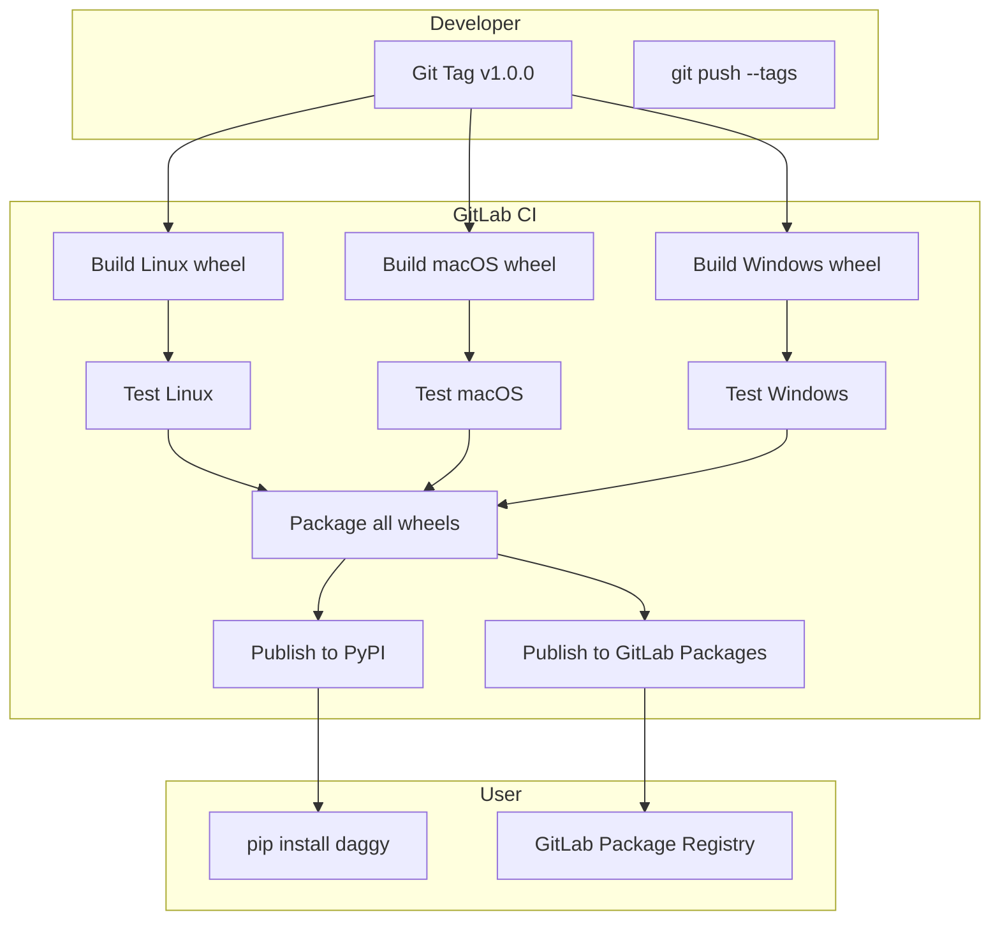

# Daggy Python Core — Full Implementation Plan

## Goal

Create a Python package `daggy` that wraps the existing [`daggy::Core`](src/DaggyCore/Core.hpp) C++ library using PySide6/shiboken6. The package provides a Python-friendly `daggy.Core` class with Qt signals for event handling.

The existing C++ Core remains **completely untouched** — the Python bindings are a separate CMake project in a separate namespace.

---

## 1. Project Structure

```
src/
  DaggyPy/                    # NEW — Python bindings project
    CMakeLists.txt            # Separate CMake project
    Core.hpp                  # daggy::python::Core header
    Core.cpp                  # Implementation
    types.hpp                 # Error, CommandStream structs + state constants
    types.cpp                 # Metatype registration
    globals.cpp               # Module init, enum registration
    bindings.xml              # shiboken6 typesystem description
  DaggyCore/                  # EXISTING — untouched
    Core.hpp
    Core.cpp
    ...

pyproject/                    # NEW — Python package root
  pyproject.toml              # Python package metadata + build config
  setup.py                    # Build script using scikit-build-core
  src/
    daggy/
      __init__.py             # Package init — imports from _daggy native module
      _daggy.pyi              # Type stubs for the native module
      core.py                 # Pure Python Core wrapper (optional convenience layer)
      types.py                # Python enum definitions matching C++ constants
  tests/
    test_core.py              # Python tests

.gitlab-ci.yml                # NEW — GitLab CI for Python package build & publish
```

---

## 2. C++ Layer: `daggy::python::Core`

### 2.1 Namespace: `daggy::python`

All Python-facing types live in `daggy::python` namespace to clearly separate from the existing `daggy` namespace.

### 2.2 Python-Friendly Types

#### `daggy::python::Error` — replaces `std::error_code` in signals

```cpp
namespace daggy::python {

struct Error {
    Q_GADGET
    Q_PROPERTY(int code MEMBER code)
    Q_PROPERTY(QString category MEMBER category)
    Q_PROPERTY(QString message MEMBER message)
public:
    int code = 0;
    QString category;
    QString message;
};

}  // namespace daggy::python
```

#### `daggy::python::CommandStream` — replaces `sources::commands::Stream`

```cpp
namespace daggy::python {

struct CommandStream {
    Q_GADGET
    Q_PROPERTY(QString session MEMBER session)
    Q_PROPERTY(QDateTime start_time MEMBER start_time)
    Q_PROPERTY(QString extension MEMBER extension)
    Q_PROPERTY(int type MEMBER type)
    Q_PROPERTY(quint64 seq_num MEMBER seq_num)
    Q_PROPERTY(QDateTime time MEMBER time)
    Q_PROPERTY(QByteArray part MEMBER part)
public:
    QString session;
    QDateTime start_time;
    QString extension;
    int type = 0;          // DaggyStreamTypes as int
    quint64 seq_num = 0;
    QDateTime time;
    QByteArray part;
};

}  // namespace daggy::python
```

### 2.3 `daggy::python::Core` Class

```cpp
namespace daggy::python {

class Core : public QObject
{
    Q_OBJECT
    Q_PROPERTY(int state READ state NOTIFY stateChanged)
    Q_PROPERTY(QString session READ session CONSTANT)
public:
    // Construct from Python dict (QVariantMap)
    explicit Core(QVariantMap sources_config,
                  QString session = QString(),
                  QObject* parent = nullptr);

    // Construct from JSON string
    explicit Core(const QString& json_sources,
                  QObject* parent = nullptr);

    ~Core();

    // Lifecycle — return error code as int (0 = success)
    Q_INVOKABLE int start();
    Q_INVOKABLE int stop();
    Q_INVOKABLE int prepare();

    // State accessors
    int state() const;
    QString session() const;

signals:
    // All signals use Python-friendly types
    void stateChanged(int state);

    void dataProviderStateChanged(QString provider_id, int state);
    void dataProviderError(QString provider_id, Error error);

    void commandStateChanged(QString provider_id,
                             QString command_id,
                             int state,
                             int exit_code);
    void commandStream(QString provider_id,
                       QString command_id,
                       CommandStream stream);
    void commandError(QString provider_id,
                      QString command_id,
                      Error error);

private:
    // Bridge from daggy::Core signals
    void onCoreStateChanged(DaggyStates state);
    void onCoreProviderStateChanged(QString provider_id, DaggyProviderStates state);
    void onCoreProviderError(QString provider_id, std::error_code error_code);
    void onCoreCommandStateChanged(QString provider_id, QString command_id,
                                    DaggyCommandStates state, int exit_code);
    void onCoreCommandStream(QString provider_id, QString command_id,
                              sources::commands::Stream stream);
    void onCoreCommandError(QString provider_id, QString command_id,
                             std::error_code error_code);

    // Conversion helpers
    static Error fromStdErrorCode(std::error_code ec);
    static CommandStream fromCommandStream(const sources::commands::Stream& stream);

    // Owned daggy::Core instance
    daggy::Core* core_ = nullptr;
};

}  // namespace daggy::python
```

---

## 3. CMake Project: `src/DaggyPy/CMakeLists.txt`

```cmake
cmake_minimum_required(VERSION 3.20)
project(daggy_py VERSION 1.0.0 LANGUAGES CXX)

set(CMAKE_CXX_STANDARD 17)
set(CMAKE_CXX_STANDARD_REQUIRED ON)
set(CMAKE_AUTOMOC ON)

# Find dependencies
find_package(Qt6 REQUIRED COMPONENTS Core Network)
find_package(Python3 REQUIRED COMPONENTS Development Interpreter)
find_package(daggy REQUIRED)  # The existing DaggyCore library

# shiboken6 for Python bindings
find_package(Shiboken6 REQUIRED)
find_package(PySide6 REQUIRED)

# Python module target — produces _daggy.so / _daggy.pyd
add_library(_daggy MODULE
    Core.hpp
    Core.cpp
    types.hpp
    types.cpp
    globals.cpp
)

target_include_directories(_daggy PRIVATE
    ${CMAKE_CURRENT_SOURCE_DIR}
)

target_link_libraries(_daggy PRIVATE
    daggy::daggycore
    Qt6::Core
    Qt6::Network
    Shiboken6::libshiboken
    PySide6::pyside6
)

# Set Python module suffix
set_target_properties(_daggy PROPERTIES
    LIBRARY_OUTPUT_DIRECTORY "${CMAKE_BINARY_DIR}/daggy"
    SUFFIX ${Python3_SUFFIX}
    PREFIX ""
)

# shiboken6 binding generation
shiboken_add_module(_daggy
    HEADERS
        Core.hpp
        types.hpp
    TYPESYSTEM
        ${CMAKE_CURRENT_SOURCE_DIR}/bindings.xml
)

# Install as Python package
install(TARGETS _daggy
    LIBRARY DESTINATION ${Python3_SITELIB}/daggy
)
```

---

## 4. shiboken6 Typesystem: `src/DaggyPy/bindings.xml`

```xml
<?xml version="1.0"?>
<typesystem package="daggy">
    <load-typesystem name="typesystem_core.xml" generate="no"/>

    <!-- Python-friendly error type -->
    <object-type name="daggy::python::Error" />

    <!-- Python-friendly stream type -->
    <object-type name="daggy::python::CommandStream" />

    <!-- Core class with all signals exposed -->
    <object-type name="daggy::python::Core" />
</typesystem>
```

---

## 5. Python Package Layer

### 5.1 `pyproject/pyproject.toml`

```toml
[build-system]
requires = ["scikit-build-core>=0.10", "pybind11"]
build-backend = "scikit_build_core.build"

[project]
name = "daggy"
version = "1.0.0"
description = "Data Aggregation Utility — Python bindings"
authors = [
    {name = "Mikhail Milovidov", email = "synacker@daggy.dev"}
]
license = {text = "MIT"}
readme = "README.md"
requires-python = ">=3.12"
dependencies = [
    "PySide6>=6.8"
]

[tool.scikit-build]
cmake.source-dir = "src/DaggyPy"
wheel.packages = ["src/daggy"]
```

### 5.2 `pyproject/src/daggy/__init__.py`

```python
"""
Daggy — Data Aggregation Utility Python Bindings.

Provides a Python-friendly Core class for running local/remote processes
and streaming aggregated output.
"""

from daggy._daggy import Core as _Core
from daggy._daggy import Error, CommandStream

# Re-export state constants as Python enums
from daggy.types import (
    State,
    ProviderState,
    CommandState,
    StreamType,
)

__all__ = [
    "Core",
    "Error",
    "CommandStream",
    "State",
    "ProviderState",
    "CommandState",
    "StreamType",
]


class Core(_Core):
    """Python-friendly wrapper around daggy::python::Core.

    Usage:
        from PySide6.QtCore import QCoreApplication
        from daggy import Core, State

        app = QCoreApplication()
        core = Core({
            "localhost": {
                "type": "local",
                "commands": {
                    "ping": {
                        "exec": "ping 127.0.0.1",
                        "extension": "log"
                    }
                }
            }
        })

        core.stateChanged.connect(lambda s: print(f"State: {s}"))
        core.prepare()
        core.start()
        app.exec()
    """

    pass
```

### 5.3 `pyproject/src/daggy/types.py`

```python
"""
State constants matching C++ enums from DaggyCore/Types.h.
"""


class State:
    """Mirrors DaggyStates enum."""
    NotStarted = 0
    Started = 1
    Finishing = 2
    Finished = 3


class ProviderState:
    """Mirrors DaggyProviderStates enum."""
    NotStarted = 0
    Starting = 1
    Started = 2
    FailedToStart = 3
    Finishing = 4
    Finished = 5


class CommandState:
    """Mirrors DaggyCommandStates enum."""
    NotStarted = 0
    Starting = 1
    Started = 2
    FailedToStart = 3
    Finishing = 4
    Finished = 5


class StreamType:
    """Mirrors DaggyStreamTypes enum."""
    Standard = 0
    Error = 1
```

### 5.4 `pyproject/src/daggy/_daggy.pyi` (type stubs)

```python
from typing import Callable, Optional
from PySide6.QtCore import QObject, Signal
from datetime import datetime


class Error:
    code: int
    category: str
    message: str


class CommandStream:
    session: str
    start_time: datetime
    extension: str
    type: int
    seq_num: int
    time: datetime
    part: bytes


class Core(QObject):
    stateChanged: Signal(int)
    dataProviderStateChanged: Signal(str, int)
    dataProviderError: Signal(str, Error)
    commandStateChanged: Signal(str, str, int, int)
    commandStream: Signal(str, str, CommandStream)
    commandError: Signal(str, str, Error)

    def __init__(
        self,
        sources_config: dict,
        session: Optional[str] = None,
        parent: Optional[QObject] = None,
    ) -> None: ...

    def start(self) -> int: ...
    def stop(self) -> int: ...
    def prepare(self) -> int: ...
    def state(self) -> int: ...
    def session(self) -> str: ...
```

---

## 6. Build Environment

### 6.1 Conan Package for DaggyPy

A new Conan package `daggy_py` that depends on `daggy` (the existing library) plus PySide6/shiboken6:

```python
# conanfile.py (add to existing or create separate)
from conan import ConanFile

class DaggyPyConan(ConanFile):
    name = "daggy_py"
    version = "1.0.0"
    settings = "os", "compiler", "build_type", "arch"
    requires = (
        "daggy/1.0.0",           # The existing DaggyCore library
        "pyside/6.8.0",          # PySide6 with shiboken6
    )
    generators = "CMakeDeps"

    def requirements(self):
        self.requires("qt/6.8.0")
        self.requires("pyside/6.8.0")

    def build(self):
        cmake = CMake(self)
        cmake.configure()
        cmake.build()
```

### 6.2 System Dependencies

**Linux (Ubuntu/Debian):**
```bash
# Qt6 + PySide6 development packages
sudo apt-get install -y \
    qt6-base-dev \
    python3-dev \
    python3-pip \
    libxcb-*-dev \
    libgl1-mesa-dev

# PySide6 via pip
pip install PySide6
```

**macOS:**
```bash
brew install qt@6
pip install PySide6
```

**Windows:**
```powershell
pip install PySide6
# Qt6 is bundled with PySide6 on Windows
```

---

## 7. GitLab CI/CD Pipeline

### 7.1 `.gitlab-ci.yml`

```yaml
stages:
  - build
  - test
  - package
  - publish

variables:
  PIP_CACHE_DIR: "$CI_PROJECT_DIR/.cache/pip"
  CONAN_HOME: "$CI_PROJECT_DIR/.conan"

cache:
  key: "$CI_JOB_NAME-$CI_COMMIT_REF_SLUG"
  paths:
    - .cache/pip
    - .conan

# ============================================================
# BUILD STAGE
# ============================================================

build:linux:
  stage: build
  image: python:3.14-bookworm
  tags:
    - linux
  before_script:
    - apt-get update && apt-get install -y
        cmake
        build-essential
        qt6-base-dev
        libxcb-*-dev
        libgl1-mesa-dev
        libssh2-1-dev
        libyaml-cpp-dev
    - pip install PySide6 scikit-build-core conan
  script:
    - conan profile detect --force
    - conan install . --build=missing
    - cmake --preset conan-release
    - cmake --build --preset conan-release --target _daggy
    - cmake --install build/Release --prefix dist
  artifacts:
    paths:
      - dist/
    expire_in: 1 week

build:macos:
  stage: build
  tags:
    - macos
  before_script:
    - brew install qt@6 cmake
    - pip install PySide6 scikit-build-core conan
  script:
    - conan profile detect --force
    - conan install . --build=missing
    - cmake --preset conan-release
    - cmake --build --preset conan-release --target _daggy
    - cmake --install build/Release --prefix dist
  artifacts:
    paths:
      - dist/
    expire_in: 1 week

build:windows:
  stage: build
  tags:
    - windows
  before_script:
    - pip install PySide6 scikit-build-core conan
    - choco install cmake --installargs 'ADD_CMAKE_TO_PATH=System'
  script:
    - conan profile detect --force
    - conan install . --build=missing
    - cmake --preset conan-release
    - cmake --build --preset conan-release --target _daggy
    - cmake --install build/Release --prefix dist
  artifacts:
    paths:
      - dist/
    expire_in: 1 week

# ============================================================
# TEST STAGE
# ============================================================

test:linux:
  stage: test
  image: python:3.14-bookworm
  needs: [build:linux]
  tags:
    - linux
  before_script:
    - apt-get update && apt-get install -y qt6-base-dev libxcb-*-dev libgl1-mesa-dev
    - pip install PySide6 pytest
  script:
    - pip install dist/*.whl
    - pytest pyproject/tests/ -v
  artifacts:
    reports:
      junit: report.xml

# ============================================================
# PACKAGE STAGE
# ============================================================

package:
  stage: package
  needs: [build:linux, build:macos, build:windows]
  tags:
    - linux
  script:
    - pip install twine
    # Build wheels for each platform
    - |
      for plat in linux macos windows; do
        pip wheel dist/$plat --no-deps -w wheelhouse/
      done
    # Merge into a single source distribution
    - python setup.py sdist -d dist/
  artifacts:
    paths:
      - wheelhouse/
      - dist/
    expire_in: 1 week

# ============================================================
# PUBLISH STAGE (only on tags)
# ============================================================

publish:pypi:
  stage: publish
  needs: [package]
  tags:
    - linux
  rules:
    - if: $CI_COMMIT_TAG =~ /^v\d+\.\d+\.\d+/
  script:
    - pip install twine
    - twine upload wheelhouse/*.whl dist/*.tar.gz
  variables:
    TWINE_USERNAME: $PYPI_USERNAME
    TWINE_PASSWORD: $PYPI_PASSWORD

publish:gitlab:
  stage: publish
  needs: [package]
  tags:
    - linux
  rules:
    - if: $CI_COMMIT_TAG =~ /^v\d+\.\d+\.\d+/
  script:
    - pip install twine
    - twine upload --repository-url $CI_API_V4_URL/projects/$CI_PROJECT_ID/packages/pypi
        wheelhouse/*.whl dist/*.tar.gz
  variables:
    TWINE_USERNAME: gitlab-ci-token
    TWINE_PASSWORD: $CI_JOB_TOKEN
```

---

## 8. Python Package Build & Publish Flow



---

## 9. Files to Create — Complete List

| # | File | Purpose |
|---|------|---------|
| 1 | [`src/DaggyPy/CMakeLists.txt`](src/DaggyPy/CMakeLists.txt) | CMake project for the native `_daggy` module |
| 2 | [`src/DaggyPy/types.hpp`](src/DaggyPy/types.hpp) | `Error`, `CommandStream` Q_GADGET structs |
| 3 | [`src/DaggyPy/types.cpp`](src/DaggyPy/types.cpp) | `qRegisterMetaType` for custom types |
| 4 | [`src/DaggyPy/Core.hpp`](src/DaggyPy/Core.hpp) | `daggy::python::Core` header |
| 5 | [`src/DaggyPy/Core.cpp`](src/DaggyPy/Core.cpp) | Implementation — wraps `daggy::Core` |
| 6 | [`src/DaggyPy/globals.cpp`](src/DaggyPy/globals.cpp) | Module init, enum registration |
| 7 | [`src/DaggyPy/bindings.xml`](src/DaggyPy/bindings.xml) | shiboken6 typesystem description |
| 8 | [`pyproject/pyproject.toml`](pyproject/pyproject.toml) | Python package metadata |
| 9 | [`pyproject/src/daggy/__init__.py`](pyproject/src/daggy/__init__.py) | Package init |
| 10 | [`pyproject/src/daggy/types.py`](pyproject/src/daggy/types.py) | Python state constants |
| 11 | [`pyproject/src/daggy/_daggy.pyi`](pyproject/src/daggy/_daggy.pyi) | Type stubs |
| 12 | [`pyproject/tests/test_core.py`](pyproject/tests/test_core.py) | Python tests |
| 13 | [`.gitlab-ci.yml`](.gitlab-ci.yml) | GitLab CI pipeline |

---

## 10. What We Do NOT Change

- [`src/DaggyCore/Core.hpp`](src/DaggyCore/Core.hpp) — untouched
- [`src/DaggyCore/Core.cpp`](src/DaggyCore/Core.cpp) — untouched
- [`src/DaggyCore/Types.h`](src/DaggyCore/Types.h) — untouched
- [`src/DaggyCore/Sources.hpp`](src/DaggyCore/Sources.hpp) — untouched
- [`src/DaggyCore/Errors.hpp`](src/DaggyCore/Errors.hpp) — untouched
- Any provider or aggregator files — untouched
- [`src/CMakeLists.txt`](src/CMakeLists.txt) — untouched (DaggyPy is a separate project)

---

## 11. Implementation Order

| Phase | Steps | Description |
|-------|-------|-------------|
| **1** | 1-7 | C++ adapter layer: `daggy::python::Core` with shiboken6 bindings |
| **2** | 8-11 | Python package scaffolding: `pyproject.toml`, `__init__.py`, stubs |
| **3** | 12 | Python tests |
| **4** | 13 | GitLab CI pipeline with multi-platform build + publish on tag |